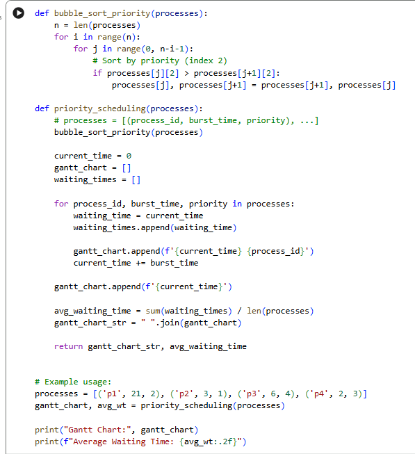

<div align="center">

# 🚀 Priority CPU Scheduling Simulator

### Priority Scheduling Algorithm Implementation in Python

[](https://www.python.org/)
[](LICENSE)
[](https://colab.research.google.com/github/tausif112/Priority-CPU-Scheduling-Simulator/blob/main/Priority.ipynb)

<br>

A Python implementation of the **Priority CPU Scheduling Algorithm** with Gantt Chart generation and Average Waiting Time calculation.

</div>

---

## 📌 Overview

This project demonstrates the implementation of the **Priority Scheduling Algorithm**, a widely used CPU scheduling technique in Operating Systems.

Each process is assigned a priority value, and the CPU executes processes according to their priority order.

In this implementation:

* Lower priority number = Higher priority
* Non-preemptive scheduling
* Bubble Sort is used to arrange processes based on priority
* Waiting Time and Average Waiting Time are calculated
* Gantt Chart representation is generated

The project was developed and tested using **Google Colaboratory (Google Colab)**.

---

## ✨ Features

* Priority Scheduling Simulation
* Process Sorting Based on Priority
* Waiting Time Calculation
* Average Waiting Time Calculation
* Gantt Chart Generation
* Google Colab Notebook Included
* Python Source Code Included

---

## 🧠 About Priority Scheduling

Priority Scheduling is a CPU Scheduling Algorithm where every process is assigned a priority value.

The CPU selects the process with the highest priority first.

### Advantages

* Important processes execute first
* Suitable for real-time systems
* Efficient resource utilization
* Easy to understand and implement

### Limitations

* Low-priority processes may wait longer
* Can cause starvation
* Requires predefined priority values

---

## ⚙️ Algorithm

1. Take a list of processes containing:

   * Process ID
   * Burst Time
   * Priority

2. Sort the processes according to priority.
3. Execute processes from highest priority to lowest priority.
4. Calculate waiting time for each process.
5. Update the execution timeline.
6. Generate the Gantt Chart.
7. Calculate Average Waiting Time.

---

## 🧮 Input Example

```python
processes = [
    ('P1', 21, 2),
    ('P2', 3, 1),
    ('P3', 6, 4),
    ('P4', 2, 3)
]
```

---

## 📊 Output Example

```text
Gantt Chart: 0 P2 3 P1 24 P4 26 P3 32

Average Waiting Time: 13.25
```

---

## 📈 Gantt Chart Representation

```text
0      3                 24      26       32
| P2 |       P1        | P4 |    P3    |
```

Execution Order:

```text
P2 → P1 → P4 → P3
```

---

## 📸 Google Colab Development Environment

The project was implemented and tested using Google Colaboratory.

### Google Colab Workspace



---

## 📸 Program Output


---

## 📂 Project Structure

```text
Priority-CPU-Scheduling-Simulator/
│
├── Priority.ipynb
├── priority.py
├── README.md
├── LICENSE
├── .gitignore
│
└── screenshots/
    ├── colab-workspace.png
    └── output.png
```

---

## 🚀 How to Run

### Clone the Repository

```bash
git clone https://github.com/tausif112/Priority-CPU-Scheduling-Simulator.git
```

### Navigate to the Project Directory

```bash
cd Priority-CPU-Scheduling-Simulator
```

### Run the Program

```bash
python priority.py
```

---

## 🛠 Technologies Used

| Technology        | Purpose                 |
| ----------------- | ----------------------- |
| Python            | Core Implementation     |
| Google Colab      | Development Environment |
| GitHub            | Version Control         |
| Operating Systems | Scheduling Concepts     |

---

## 📋 Sample Waiting Time Table

| Process | Burst Time | Priority | Waiting Time |
| ------- | ---------- | -------- | ------------ |
| P2      | 3          | 1        | 0            |
| P1      | 21         | 2        | 3            |
| P4      | 2          | 3        | 24           |
| P3      | 6          | 4        | 26           |

### Average Waiting Time

```text
(0 + 3 + 24 + 26) / 4

= 53 / 4

= 13.25
```

---

## 🔮 Future Improvements

* Arrival Time Support
* Turnaround Time Calculation
* Response Time Calculation
* Preemptive Priority Scheduling
* Aging Technique to Prevent Starvation
* Graphical Gantt Chart Visualization
* Interactive User Input
* Comparison with FCFS, SJF, and Round Robin

---


## 👨‍💻 Author

### Md Tausif Uddin

Department of Computer Science & Engineering (CSE)  
University of Asia Pacific (UAP)

GitHub: https://github.com/tausif112

---

<div align="center">

⭐ If you found this project useful, consider giving it a star!

</div>
